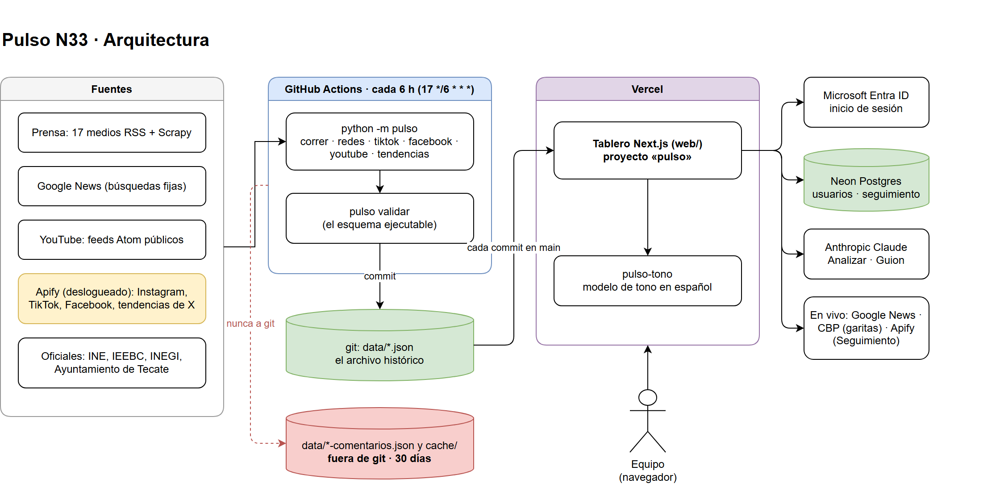

# 01 · Estructura del proyecto

Para quién: técnico. Qué cuenta: cómo está armado Pulso N33, dónde vive cada
cosa, qué pantallas hay y quién las ve, y de qué servicios externos depende.

Verificado el 5 de octubre de 2026 · commit `2e66668` · repositorio
`arturoreyes-ai/pulso-n33`.

---

## 1. La arquitectura en una frase

**Un pipeline en Python corre en GitHub Actions cada seis horas, escribe
archivos JSON en `data/`, los commitea, y un sitio Next.js en Vercel los lee.**
No hay servidor propio ni base de datos para las noticias: el repositorio
versionado *es* el archivo histórico. La única base de datos (Neon) guarda
usuarios y lo que el equipo sigue a mano.



Editable en draw.io: [`diagramas/arquitectura.drawio`](diagramas/arquitectura.drawio).

Tres piezas:

| Pieza | Dónde | Qué hace | Quién la dispara |
|---|---|---|---|
| Pipeline | `pulso/` (Python 3.11) | Cosecha, limpia, zonifica, etiqueta tono, valida y escribe `data/` | El cron de GitHub Actions |
| Tablero | `web/` (Next.js 16, React 19) | Lee `data/`, consulta en vivo Google News y CBP, ofrece los botones de IA y el seguimiento | Las personas del equipo |
| Servicio de tono | `servicio-tono/` (Python 3.12, Vercel) | Etiqueta tono de un texto con el modelo local, por HTTP | El tablero |

## 2. Árbol de carpetas

```
Scrapper/
├── AGENTS.md            reglas para modificar el código (leer antes de tocar pulso/)
├── PRODUCT.md           qué afirma el producto y qué no
├── README.md            manual de operación por comando
├── docs/
│   ├── PLAN.md          documento del cliente, copia literal
│   ├── datos.md         contrato de cada JSON
│   ├── acceso.md        receta de Entra ID + Neon
│   ├── publicidad-meta.md
│   └── manuales/        esta documentación
├── config/              16 catálogos editados a mano (medios, cuentas, búsquedas…)
├── data/                lo que escribe el robot; NO se edita a mano
│   ├── archivo/         notas que salieron de la ventana de 30 días, por mes
│   └── pauta-meta/      anuncios de Meta por persona
├── cache/               texto crudo de redes, 30 días, git-ignorado
├── pulso/               el pipeline (≈40 módulos, nombres en español)
│   ├── __main__.py      los 21 verbos de `python -m pulso`
│   ├── validador.py     el esquema ejecutable: manda sobre docs/datos.md
│   ├── pipeline.py      la ingesta de prensa
│   ├── zonas.py         el gacetero: a qué lugar pertenece cada titular
│   ├── redes.py         núcleo común de Instagram, TikTok y Facebook
│   └── spiders/         Scrapy, solo para 3 medios sin RSS
├── tests/               34 módulos unittest, ~990 pruebas, todas sin red
├── web/                 el tablero
│   ├── db/              5 migraciones SQL de Neon
│   ├── scripts/         sincronizar-datos, migrar, 11 pruebas probar-*.cjs
│   ├── public/data/     copia de data/ hecha al construir; NO se edita
│   └── src/
│       ├── app/         rutas (páginas y API)
│       ├── components/  UI por área: paneles, lector, seguimiento, reportes, ui…
│       ├── lib/         dominio, búsqueda, análisis (IA), acceso, seguimiento
│       ├── auth.ts      Auth.js con Microsoft Entra ID
│       └── proxy.ts     la puerta: toda petición pasa por aquí
├── servicio-tono/       función de Vercel aparte con el modelo de tono
├── sitio/               el tablero anterior, HTML plano (solo pruebas de CI)
└── .github/workflows/   pulso.yml (el cron) y ci.yml (pruebas en cada PR)
```

**Convención de idioma:** todo identificador es en español (`correr`,
`cosechar`, `zonas.py`, `ZONAS_PRODUCTO`). No se introduce un nombre en inglés
ni se «normaliza» uno existente. Los comentarios en Python van sin acentos; los
JSON, TypeScript y Markdown, con acentos.

## 3. Las pantallas

Todas exigen sesión de Microsoft con cuenta **activa y aprobada**, salvo
`/entrar`. La comprobación ocurre en `web/src/proxy.ts`, que consulta la base en
cada petición; revocar a alguien surte efecto en su siguiente clic.

| URL | Qué muestra | Quién la ve |
|---|---|---|
| `/` | **En Tendencia**: titulares en vivo, uno por pantalla, por capítulos (la sección del lugar y cinco temas). `?e=mexico\|internacional`, `?t=<tema>`, `?q=<búsqueda>` | Todos |
| `/<zona>` | Lo mismo empezando en un municipio | Todos |
| `/redes` | **Redes**: publicaciones de TikTok, Instagram, Facebook y YouTube, y tendencias de X, de toda la región | Todos |
| `/<zona>/redes` | Redes de un municipio | Todos |
| `/garitas` | Tiempos de espera de San Ysidro y Otay Mesa (CBP) | Todos |
| `/gasto-electoral` | Gasto fiscalizado 2024, financiamiento partidista 2026, anuncios políticos en Meta | Todos |
| `/seguimiento` | Lista compartida de publicaciones que el equipo sigue | Todos |
| `/seguimiento/<id>` | Una publicación seguida: cifras fechadas, comentarios, tono, resumen | Todos |
| `/guion?p=<programa>` | Guion de locución por programa, escrito con IA | Todos; no existe (404) si la IA está apagada |
| `/reportes` | Expedientes y términos seguidos, con búsqueda | Solo admin (404 para el resto) |
| `/reportes/<expediente>` | Un expediente: el año de una persona en prensa y redes, con PDF | Solo admin |
| `/admin/usuarios` | **Accesos**: solicitudes pendientes y cuentas del equipo | Solo admin |
| `/entrar` | Botón «Entrar con Microsoft» | Público |

`/ahora` redirige a `/` (308). Las zonas válidas son `tijuana`, `mexicali`,
`ensenada`, `rosarito`, `tecate`, `san-quintin`, `san-felipe` y `san-diego`;
cualquier otra da 404.

**Navegación.** En escritorio, un riel a la izquierda: *Leer* (En Tendencia,
Redes, Garitas) y *Producir* (Reportes —solo admin—, Guion, Seguimiento, Gasto
electoral); la cuenta abajo, con «Accesos» para admin y «Salir». En el
teléfono, una barra inferior de cuatro pestañas: En Tendencia, Redes, Guion (o
Garitas si la IA está apagada) y «Más».

## 4. Permisos

| Rol | Puede |
|---|---|
| `lector` | Todo el tablero salvo lo de abajo |
| `admin` | Además: `/reportes`, expedientes y sus PDF, `/admin/usuarios` (aprobar, revocar, cambiar rol, desactivar) |

- Nadie puede editarse a sí mismo.
- La cuenta en `ACCESO_PRIMER_ADMIN` se vuelve admin activa y aprobada en cada
  entrada: es el arranque y la puerta de emergencia.
- Sin contraseñas propias, sin registro, sin recuperación: Microsoft es el
  dueño de la identidad. La sesión dura 8 horas.

Hoy hay **16 cuentas en producción: 6 admin y 10 lectores**, todas activas y
aprobadas.

## 5. Servicios externos

| Servicio | Para qué | Cuesta | Dónde se configura |
|---|---|---|---|
| GitHub Actions | Corre el pipeline cada 6 h y las pruebas | Incluido | `.github/workflows/` |
| Vercel (`pulso`) | Hospeda el tablero; construye cada commit de `main` | Plan de Vercel | Proyecto `pulso`, scope `areyes-1125` |
| Vercel (`pulso-tono`) | Modelo de tono en español por HTTP | Plan de Vercel | `servicio-tono/` |
| Neon | Postgres: usuarios y seguimiento | Nivel gratuito | `DATABASE_URL` |
| Microsoft Entra ID | Inicio de sesión | Incluido en M365 | Registro de aplicación en Azure |
| Apify | Cosecha deslogueada de Instagram, TikTok, Facebook y tendencias de X; lecturas de Seguimiento | Plan de $199/mes; topes propios | `APIFY_TOKEN` |
| Anthropic (Claude) | Analizar, Guion, Detallar, resumen de comentarios | Por uso, centavos por botón | `ANTHROPIC_API_KEY` |
| Google News | Titulares en vivo de la portada y la búsqueda | Gratis | — |
| CBP | Tiempos de garita | Gratis | — |
| YouTube | Feeds Atom públicos (gratis); la API de datos está apagada | Gratis | `YOUTUBE_API_KEY` |
| Brave Search | Sondeo de descubrimiento web en consultas, a mano | ~$0.005 por consulta | `BRAVE_API_KEY` |
| Meta Ad Library API | Anuncios políticos, a mano | Gratis con token | `META_ADS_TOKEN` |

## 6. Límites que vienen de la ley, no del código

Están escritos en `AGENTS.md` («Legal boundaries») y conviene conocerlos antes
de pedir un cambio:

- **Nunca raspado con sesión iniciada** en redes (Meta v. Bright Data). Rentar
  el raspador no cambia esto; `pulso/apify.py` rechaza un actor con cookies.
- **Solo titular, medio y enlace** de la prensa; nunca el cuerpo del artículo.
  «Analizar» y «Detallar» leen un artículo a pedido, sin guardarlo.
- **Ni texto ni identidad de quien comenta** entra a git.
- **El tono no es postura**: el tablero no cruza el tono con figuras públicas,
  salvo las dos excepciones que decidió el cliente (consultas y seguimiento).

---

Pulso N33 · 01 Estructura · verificado el 5 de octubre de 2026
