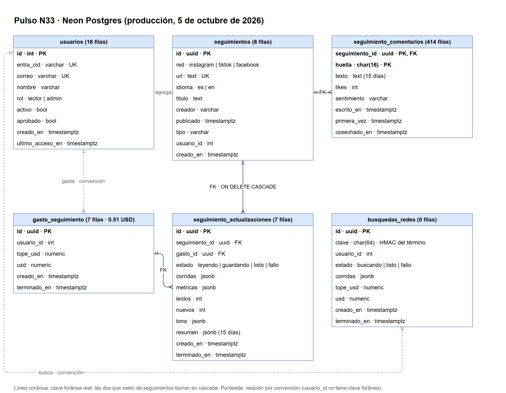

# 02 · Modelo de datos

Para quién: técnico. Qué cuenta: dónde vive cada dato, en qué forma, quién lo
escribe, quién lo lee y cuándo se borra.

Verificado el 5 de octubre de 2026 contra el commit `2e66668` y contra la base
de producción en Neon (proyecto `shy-butterfly-86316003`, rama
`br-broad-queen-ary6a5e9`).

---

## 1. Tres almacenes, tres reglas

| Almacén | Qué guarda | En git | Retención | Quién escribe |
|---|---|---|---|---|
| `data/*.json` | Notas, publicaciones destacadas, conteos, tendencias, indicadores | **Sí** | Para siempre (el historial de git es el archivo) | El cron, como `pulso-bot` |
| `data/*-comentarios.json` y `cache/` | Texto de comentarios, crudo de las plataformas | **No** (`.gitignore`) | 30 días, purgado en cada corrida | El cron y los comandos a mano |
| Neon Postgres | Usuarios del tablero y Seguimiento | No | Usuarios: indefinida. Texto de comentarios seguidos: 15 días | El tablero |

La regla que lo ordena todo: **lo que entra a git vive en cada clon y en cada
commit anterior, para siempre.** Por eso ningún texto escrito por una persona
del público —ni su nombre, ni su id— entra a git.

**Jerarquía de verdad.** Si este documento, `docs/datos.md` y el código no
coinciden, manda `pulso/validador.py` (`python -m pulso validar`). Después
`docs/datos.md`, después `web/src/lib/datos/tipos.ts`.

## 2. Los archivos de `data/`

Cifras del corte del 2 de octubre de 2026, 12:56 UTC.

### En git

| Archivo | Lo escribe | Contenido | Lo lee |
|---|---|---|---|
| `notas.json` (8.7 MB) | `correr` | **10 409 notas** de los últimos 30 días: id, título, medio, enlace, fecha, zonas, `alcance`, `postura`, figuras, `rubros`, imagen | El servidor del tablero (enriquecer titulares en vivo, Notas relacionadas, guion). El navegador **no** lo descarga |
| `archivo/notas-AAAA-MM.json` | `correr` | Notas que salieron de la ventana, por mes (12 meses hoy) | Búsqueda en el archivo |
| `fuentes.json` | `correr` | Estado de cada fuente en la última corrida | — |
| `estado.json` | `correr` | Resumen de corrida: 22 fuentes ok, 2 fallo, notas por zona, enlace a la corrida | `validar` (frescura) |
| `temas.json` | `correr` | Temas por n-gramas, globales y por zona | Nadie desde el 15 de septiembre (se sigue escribiendo) |
| `comunicados.json` | `comunicados` | 13 comunicados del Ayuntamiento de Tecate | En Tendencia, capítulo de Tecate |
| `redes.json` | `redes` | Instagram: 94 publicaciones destacadas, conteos, salud por cuenta | Redes |
| `tiktok.json` | `tiktok` | 142 videos destacados, con creador y `rubros` | Redes, Guion |
| `facebook.json` | `facebook` | 41 publicaciones de 5 páginas | Redes |
| `youtube.json` | `youtube` | 112 piezas (Shorts y videos) de feeds públicos | Redes, Guion |
| `tendencias.json` | `tendencias` | Tendencias de X por ubicación: nombre, rango, enlace | Redes, pestaña X |
| `consultas.json` | `consultas` (a mano) | 3 términos seguidos: prensa con tono, publicaciones, conteos | Reportes |
| `gasto-electoral.json`, `financiamiento-partidos.json` | `gasto-electoral` | INE 2024 e IEEBC 2026 | Gasto electoral |
| `pauta-meta.json`, `pauta-meta/<persona>.json` | `publicidad-meta` (a mano) | Anuncios políticos en Meta por persona | Gasto electoral |
| `indicadores.json` | `indicadores` | SHF, predial, SESNSP, ENSU, San Diego | Nadie desde el 28 de septiembre (se sigue escribiendo) |
| `conversacion.json` | `conversacion` | Comentarios de YouTube por API, solo conteos | Nadie; congelado desde el 4 de septiembre |

### Fuera de git

| Archivo | Contenido |
|---|---|
| `redes-comentarios.json`, `tiktok-comentarios.json`, `facebook-comentarios.json` | Texto de los comentarios más votados de cada destacado, **sin autor** |
| `consultas-comentarios.json` | Lo mismo para los términos seguidos |
| `expedientes-comentarios.json` | Comentarios y resúmenes del expediente anual |

Llegan al sitio solo si el sitio se construye en la misma máquina que los
escribió (ver manual técnico, §5).

### Estados que no son cero

El tablero distingue cuatro cosas que un cero confundiría:

| Estado | Significa |
|---|---|
| `0` | Se midió y no hubo |
| `sin dato` | La fuente no publica la cifra o no respondió |
| `fuera de muestra` | Ese lugar o esa fuente no se mide |
| `null` en `postura` | El modelo no habla el idioma de la nota (inglés): 1 311 notas hoy |

**Nunca se rellena un hueco con un cero.** Es la regla 4 del producto y el
validador la hace cumplir.

## 3. Los catálogos de `config/`

Son la parte que el administrador edita. Cada archivo lleva un campo `"nota"`
que explica para qué es, y cada fila desactivada lleva su razón: una fuente no
se borra, se apaga con `"activo": false` y se dice por qué.

| Archivo | Controla | Filas (activas / total) |
|---|---|---|
| `medios.json` | Prensa por RSS o Scrapy | 17 / 20 |
| `busquedas.json` | Búsquedas fijas en Google News | 6 / 6 |
| `instagram.json` | Cuentas de Instagram (+14 señuelos) | 32 / 39 |
| `tiktok.json` | Búsquedas de TikTok · perfiles | 13 / 20 · 8 / 8 |
| `facebook.json` | Páginas de Facebook | 5 / 5 |
| `youtube.json` | Canales de YouTube (feeds) | 22 / 27 |
| `tendencias.json` | Ubicaciones de X | 5 / 10 |
| `canales.json` | Canales para la API de YouTube (apagada) | 11 / 15 |
| `consultas.json` | Términos seguidos · buscadores de medios | 2 / 3 · 6 / 7 |
| `expedientes-redes.json` | Cuentas y búsquedas del expediente | 1 expediente |
| `roster.json` | Figuras públicas, con vigencia | 9 (8 vigentes) |
| `comunicados.json` | Fuente municipal de Tecate | 1 |
| `gasto-electoral.json` | Procesos del INE y URLs del IEEBC | 2 procesos |
| `publicidad-meta.json` | Personas con anuncios a vigilar | 10 (2 con página) |
| `apify.json` | Catálogo de actores y presupuesto | 7 (registro, no interruptor) |
| `delegaciones-tijuana.json` | Catálogo de IMPLAN; **no se edita a mano** | 9 delegaciones |

Campos comunes: `activo`, `verificado` (fecha del sondeo que justificó
activarla; sin ella, una fila activa se salta con aviso), `razon` o `nota`,
`zona` o `ambito` (Instagram y Facebook: una cuenta lleva uno u otro, nunca
ambos).

## 4. La base de datos (Neon)

Seis tablas, creadas por las cinco migraciones de `web/db/`, que se aplican con
`pnpm --dir web migrar`. Las líneas de `usuarios` en el diagrama son relaciones por convención, no claves foráneas (ver «Integridad»).



Editable en draw.io: [`diagramas/neon-modelo-de-datos.drawio`](diagramas/neon-modelo-de-datos.drawio).

### Conteos reales (5 de octubre de 2026)

| Tabla | Filas | Para qué |
|---|---|---|
| `usuarios` | 16 (6 admin, 10 lector) | Quién entra y con qué rol |
| `seguimientos` | 6 (3 TikTok, 2 Instagram, 1 Facebook) | Lista compartida de publicaciones seguidas |
| `seguimiento_actualizaciones` | 7 | Cada lectura pagada: cifras, tono y resumen. Las cifras se quedan para siempre |
| `seguimiento_comentarios` | 414 | Texto sin autor; se borra 15 días después de la última lectura que lo trajo |
| `gasto_seguimiento` | 7 ($0.51 en total) | Libro de gasto. **Borrar un seguimiento no lo toca**, para que no libere el tope |
| `busquedas_redes` | 0 | Libro de la búsqueda pagada en vivo, hoy fuera de pantalla. Guarda un HMAC, nunca el término |

### Integridad

Hay **tres claves foráneas**: `seguimiento_actualizaciones` y
`seguimiento_comentarios` apuntan a `seguimientos` con `ON DELETE CASCADE`
(«Dejar de seguir» borra todo lo de esa publicación), y
`seguimiento_actualizaciones.gasto_id` apunta a `gasto_seguimiento` sin
cascada. Las columnas `usuario_id` **no** tienen clave foránea: se relacionan
con `usuarios.id` por convención.

### Consultas útiles (solo lectura)

```sql
-- Quién está pendiente de aprobación
select correo, nombre, creado_en from usuarios where not aprobado order by creado_en;

-- Gasto de Seguimiento en el mes (tope: 20 USD)
select round(sum(coalesce(usd, tope_usd)), 2)
from gasto_seguimiento
where creado_en >= date_trunc('month', now() at time zone 'America/Tijuana');

-- Última lectura de cada publicación seguida
select s.red, s.titulo, max(a.terminado_en) as ultima
from seguimientos s left join seguimiento_actualizaciones a on a.seguimiento_id = s.id
group by s.id order by ultima desc nulls last;
```

## 5. Qué se borra y cuándo

| Dato | Se borra | Quién lo borra |
|---|---|---|
| Notas fuera de 30 días | Se mueven a `data/archivo/`, no se borran | `correr` |
| `cache/` (crudo de redes) | A los 30 días | Cada corrida del cron |
| `data/*-comentarios.json` | Se regeneran en cada corrida desde `cache/` | El cron |
| Texto en `seguimiento_comentarios` | 15 días después de la última lectura que lo trajo | Cron de Vercel diario (`/api/seguimiento/purgar`, 09:23 UTC) y cada visita |
| `resumen` de una actualización | Con el texto, a los 15 días | Igual |
| Un seguimiento completo | Al pulsar «Dejar de seguir» | La persona |
| Datasets crudos en Apify del Seguimiento | En cuanto se guarda la copia limpia | El tablero |

---

Pulso N33 · 02 Modelo de datos · verificado el 5 de octubre de 2026
