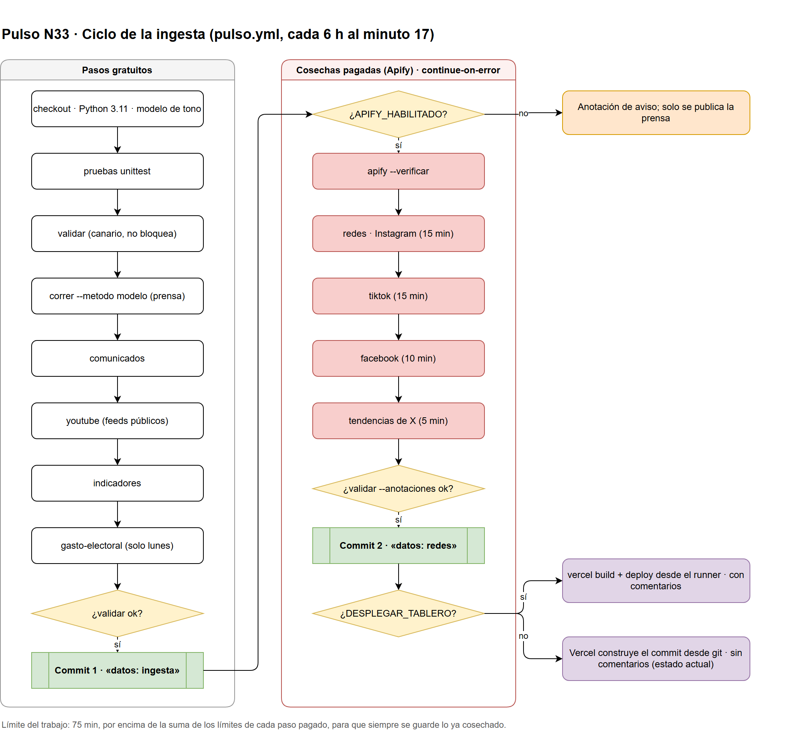

# 03 · Manual técnico

Para quién: mantenimiento y DevOps. Qué cuenta: cómo levantar el proyecto en
una máquina, cómo corre la ingesta, cómo se despliega y qué hacer cuando algo
falla.

Verificado el 5 de octubre de 2026 · commit `2e66668`.

> Antes de cambiar cualquier cosa en `pulso/`, lee [`AGENTS.md`](../../AGENTS.md)
> completo. Varias «mejoras» obvias —rellenar un hueco con cero, añadir una
> marca de hora, cachear texto de comentarios— rompen una obligación legal o
> la promesa central del producto.

---

## 1. Entorno local

### Requisitos

| Herramienta | Versión |
|---|---|
| Python | 3.11 (el servicio de tono usa 3.12) |
| Node | 22 |
| pnpm | 11.18 |
| Git | con `.gitattributes` respetado (fuerza LF) |

En PowerShell, antes de cualquier comando de Python:

```powershell
$env:PYTHONUTF8 = "1"
```

### El pipeline

```bash
python -m pip install -r requirements.txt
```

`requirements.txt` es **una línea** (Scrapy). Todo lo demás —RSS, HTTP, el
validador, los temas— es biblioteca estándar. No se agregan `requests`,
`pandas`, `feedparser` ni `beautifulsoup4`.

El modelo de tono es opcional y pesa (~430 MB más torch en CPU):

```bash
python -m pip install torch --index-url https://download.pytorch.org/whl/cpu
```

```bash
python -m pip install -r requirements-modelo.txt
```

Sin él todo corre con `--metodo ninguno` y las notas salen con `postura: null`.

### El tablero

```bash
pnpm --dir web install
```

```bash
pnpm --dir web dev
```

Abre `http://localhost:3000`. `dev` copia primero `data/` a `web/public/data/`;
**solo al arrancar**. Si el pipeline corrió después, o hiciste `git pull`,
vuelve a copiar:

```bash
pnpm --dir web datos
```

Variables locales: copia `web/.env.example` a `web/.env.local`. Para entrar sin
Entra ID en desarrollo, `ACCESO_SIN_ENTRA=true` (solo funciona fuera de
producción). El pipeline lee también `.env`, `.env.local`, `web/.env` y
`web/.env.local`, en ese orden; el entorno real gana.

> **Cuidado:** si tu `.env` tiene `APIFY_TOKEN`, un sondeo «de prueba» es una
> llamada real y pagada.

### La comprobación por omisión

```bash
python -m pulso correr --sin-red --salida "$TEMP/pulso-prueba"
```

Corre todo el pipeline sin red sobre 15 titulares reales. **Pasa siempre
`--salida`**: sin ella reescribe `data/` con esos 15 titulares.

## 2. Los comandos

`python -m pulso <verbo>`. Los que cuestan dinero están marcados.

| Verbo | Escribe | Cron | Costo |
|---|---|---|---|
| `correr` | `notas.json`, `fuentes.json`, `estado.json`, `temas.json`, `archivo/` | Sí | Gratis |
| `comunicados` | `comunicados.json` | Sí | Gratis |
| `youtube` | `youtube.json` | Sí | Gratis |
| `indicadores` | `indicadores.json` (se salta si tiene < 7 días) | Sí | Gratis |
| `gasto-electoral` | `gasto-electoral.json`, `financiamiento-partidos.json` | Lunes | Gratis |
| `validar` | Nada; sale con 1 si hay error | Sí, tres veces | Gratis |
| `apify --verificar` | Nada; revisa token y catálogo | Sí | Gratis |
| `redes` | `redes.json` + comentarios | Sí | **Apify** |
| `tiktok` | `tiktok.json` + comentarios | Sí | **Apify** |
| `facebook` | `facebook.json` + comentarios | Sí | **Apify** |
| `tendencias` | `tendencias.json` | Sí | **Apify** |
| `conversacion` | `conversacion.json` | Solo con `YOUTUBE_HABILITADO` | Cuota de la API |
| `consultas` | `consultas.json` + comentarios | No, a mano | **Apify** (gratis con `--sin-cosecha`) |
| `expediente-redes` | `web/src/lib/expedientes/<id>-redes.json` + comentarios | No, a mano | **Apify**; `--estimar` primero |
| `publicidad-meta` | `pauta-meta.json` | No, a mano | Gratis |
| `delegaciones --actualizar` | `config/delegaciones-tijuana.json` y el mapa TS | No | Gratis |
| `tono --servir` | Nada; servidor local de tono en :8765 | No | Gratis |
| `sitio`, `servir`, `evaluar` | El tablero anterior y la línea base | No | Gratis |

Los sondeos (`--sondear`, `--probar`, `--muestra`) **no escriben nada** y son
el paso obligatorio antes de activar una cuenta (ver manual del administrador).

**Códigos de salida.** `correr` devuelve **2** solo cuando ninguna fuente
respondió (apagón total); una falla parcial es normal y sale 0. `validar`
devuelve 1 ante cualquier error. No se suavizan.

## 3. El ciclo de la ingesta

`.github/workflows/pulso.yml`, cada seis horas al minuto 17 (`17 */6 * * *`),
más los lunes a las 18:41 UTC para el gasto electoral. También corre con cada
push a `main` que no sea solo Markdown o `docs/`, y a mano desde la pestaña
Actions.



Editable en draw.io: [`diagramas/ciclo-de-ingesta.drawio`](diagramas/ciclo-de-ingesta.drawio).

Lo que no es obvio:

- **Dos commits, no uno.** La prensa se guarda antes de las cosechas pagadas.
  Del 21 al 24 de septiembre las 22 corridas murieron dentro de TikTok y se
  llevaron la prensa con ellas.
- **Cada paso pagado tiene su propio límite de tiempo y `continue-on-error`.**
  El trabajo entero tiene 75 minutos, por encima de la suma, para que siempre
  salte primero el límite del paso y se guarde lo demás.
- **Las cosechas llaman a Apify en paralelo** (seis a la vez) y aplican
  resultados en orden: la salida sigue siendo idéntica byte a byte.
- **El commit del robot no dispara otro flujo** (los commits con
  `GITHUB_TOKEN` no disparan `on: push`). Por eso la ingesta y el despliegue
  no se separan en dos flujos.
- **Determinismo.** Dos corridas sobre la misma entrada producen archivos
  idénticos; si no, cada corrida haría un commit de ruido. Cualquier serie
  nueva va ordenada y con su clave explícita.

### Secretos y variables del repositorio

| Nombre | Tipo | Para qué |
|---|---|---|
| `APIFY_TOKEN` | Secreto | Cosechas de redes |
| `YOUTUBE_API_KEY` | Secreto | Panel de conversación (apagado) |
| `VERCEL_TOKEN`, `VERCEL_ORG_ID`, `VERCEL_PROJECT_ID` | Secretos | Despliegue desde el runner |
| `APIFY_HABILITADO` | Variable | `true` enciende todas las cosechas pagadas |
| `YOUTUBE_HABILITADO` | Variable | Panel de conversación; **apagado pendiente de opinión legal** |
| `DESPLEGAR_TABLERO` | Variable | Despliegue desde el runner (hoy sin definir) |

### CI

`.github/workflows/ci.yml` corre en cada PR: pruebas de Python, `validar`, una
corrida completa sin red a un directorio temporal, `validar` sobre esa salida,
el sitio anterior, y en `web/`: `pnpm tipos`, diez scripts `probar-*.cjs`,
`pnpm tokens` y `pnpm build`. Sin secretos. Debe estar en verde antes de pedir
revisión.

## 4. Pruebas

```bash
python -m unittest discover -s tests -v
```

34 módulos, ~990 pruebas, **todas sin red** y sin cargar el modelo (se usa
`AnalizadorFalso`). Leen los `config/*.json` reales, así que editar un catálogo
puede romper una prueba legítimamente: revisa eso antes de culpar al código.

```bash
pnpm --dir web tipos
```

```bash
node web/scripts/probar-seguimiento.cjs
```

Hay once `probar-*.cjs` (análisis, aprobación, búsqueda, capítulos, consultas,
garitas, informe, publicaciones, publicidad-meta, redes-en-vivo, seguimiento).
CI corre diez; `probar-publicidad-meta.cjs` no.

## 5. Despliegue

### Cómo está hoy

**La integración Git de Vercel construye cada commit de `main`, incluidos los
del robot.** Cada ingesta produce un despliegue de producción en 24–48 s, que
corre `sincronizar-datos.mjs` sobre el `data/` nuevo. Comprobarlo:

```bash
vercel ls pulso --scope areyes-1125
```

```bash
vercel inspect <url> --logs --scope areyes-1125
```

**Consecuencia:** el sitio publicado sale **sin texto de comentarios**, porque
ese texto no está en git. Los paneles lo dicen: «El texto de los comentarios no
está disponible en esta vista». No es un error del panel.

### El despliegue desde el runner (apagado)

Es la única forma de publicar con comentarios. Para encenderlo:

1. Crear los secretos `VERCEL_TOKEN`, `VERCEL_ORG_ID`, `VERCEL_PROJECT_ID`.
2. Definir la variable `DESPLEGAR_TABLERO=true`.

Con eso el runner construye y despliega con el texto que acaba de escribir, y
el robot añade `Despliegue: runner` a sus commits para que `web/vercel.json`
(`ignoreCommand`) le diga a Vercel que no construya también esos commits.
Definir solo la variable, sin los secretos, hace fallar el paso.

### Reglas

- **Nunca hagas un commit vacío para redesplegar**: dispara una ingesta
  completa, actores pagados incluidos.
- No escribas el token de salto de CI en el mensaje de un commit que sí quieres
  que corra, ni siquiera citado en el cuerpo: GitHub lee el mensaje entero.
- Variables del tablero: en Vercel → Settings → Environment Variables. La
  lista completa y comentada está en `web/.env.example`.

### Migraciones de Neon

```bash
DATABASE_URL="postgresql://..." pnpm --dir web migrar
```

Aplica **todos** los `web/db/*.sql` en orden, cada vez; no hay bitácora de
migraciones, así que cada archivo debe ser idempotente. Alternativa: pegar el
SQL en el editor de Neon.

### El servicio de tono (`pulso-tono`)

Proyecto de Vercel aparte, en `https://pulso-tono.vercel.app/api/tono`.

```bash
node servicio-tono/empaquetar.mjs
```

y después, **dentro de `servicio-tono/`**:

```bash
vercel deploy --prod --scope areyes-1125
```

**Nunca desde la raíz del repositorio**: `vercel deploy` ignora `.gitignore` y
subiría `cache/` con texto crudo de comentarios. En el proyecto de Vercel:
`TONO_EMPAQUETAR=1`, `VERCEL_SUPPORT_LARGE_FUNCTIONS=1` y `TONO_SECRETO`. En el
tablero: `TONO_URL` y el mismo `TONO_SECRETO`. Salud:
`GET /api/tono?salud=1` con el secreto en `X-Tono-Secreto`. Arranque en frío
~10 s, luego ~120 ms por texto.

En local: `python -m pulso tono --servir` y
`TONO_URL=http://127.0.0.1:8765/` en `web/.env.local`.

## 6. Variables de entorno del tablero

| Variable | Efecto |
|---|---|
| `AUTH_SECRET` | Firma de la sesión; también la clave del HMAC de búsquedas |
| `AUTH_MICROSOFT_ENTRA_ID_ID`, `_SECRET`, `_ISSUER` | Las tres o no hay entrada |
| `ACCESO_PRIMER_ADMIN` | Correo que siempre es admin |
| `AVISO_SOLICITUD_REMITENTE`, `AVISO_SOLICITUD_PARA` | Correo a admins cuando alguien pide acceso |
| `DATABASE_URL` (o `NEON_DB_DATABASE_URL`) | Neon |
| `ANALISIS_HABILITADO=true` + `ANTHROPIC_API_KEY` | Analizar, Detallar, Guion, resumen de comentarios |
| `SEGUIMIENTO_HABILITADO=true` + `APIFY_API_TOKEN` + base | Botón «Actualizar» de Seguimiento |
| `BUSQUEDA_REDES_HABILITADA=true` + Apify + base + `AUTH_SECRET` | Búsqueda pagada en vivo (sin botón en pantalla desde el 30 de septiembre) |
| `TONO_URL`, `TONO_SECRETO` | Tono de comentarios; sin ellos todo sale «sin tono» |
| `CRON_SECRET` | Protege `/api/seguimiento/purgar` |
| `NEXT_PUBLIC_DATOS_URL` | Ruta de los JSON (por omisión `/data`); se fija al construir |

## 7. Diagnóstico

### «El sitio está viejo»

No mires el sitio, mira el archivo:

```bash
git log origin/main -1 -- data/tiktok.json
```

y su campo `generado`. Si la prensa está al día y las redes no, casi siempre
es **`APIFY_HABILITADO` apagado** o un paso pagado que murió por tiempo.
Revisa la última corrida en Actions: las anotaciones amarillas lo dicen.
`pulso validar` avisa cuando un panel lleva más de 12 h detrás de
`estado.json`, y las tarjetas de Redes muestran la fecha en lugar de «hace 2 h»
en ese caso.

En local, si el guion sale sin clips: `web/public/data` es de cuando arrancaste
`pnpm dev`. `pnpm --dir web datos`.

### Tabla de síntomas

| Síntoma | Causa probable | Qué hacer |
|---|---|---|
| Redes sin comentarios en producción | El sitio lo construye Vercel desde git | Esperado; encender el despliegue desde el runner (§5) |
| Todas las cuentas de redes «ok» pero vacías | Falta el token de Apify | `python -m pulso apify --verificar` |
| La corrida sale con código 2 | Ninguna fuente de prensa respondió | Revisar red del runner; es un apagón, no una falla parcial |
| `validar` falla tras editar `config/` | Fila activa sin `verificado`, `zona` y `ambito` a la vez, `marca` duplicada | Leer el mensaje: dice la regla y el porqué |
| Cada corrida hace commit aunque no haya noticias | Algo no determinista (orden de un set, una hora) | Encontrarlo; `TestDeterminismo` debería atraparlo |
| `redirect_uri_mismatch` al entrar | URI de redirección mal registrada en Azure | Debe ser `…/api/auth/callback/microsoft-entra-id`, tipo Web |
| `AADSTS7000215` | Se copió el «Id. de secreto» en vez del valor | Generar otro secreto y copiar la columna Valor |
| Todo da 404 en Vercel | El proyecto no tiene el preset de Next.js | `docs/acceso.md` §7 |
| API responde 401 / 403 / 503 | Sin sesión / sin aprobar o desactivado / Neon caído | Revisar la cuenta en Accesos o el estado de Neon |
| Todo dice «sin tono» | Falta `TONO_URL` o `TONO_SECRETO`, o el servicio está frío | `GET /api/tono?salud=1` |
| Guion o Analizar no aparecen | `ANALISIS_HABILITADO` o la llave faltan | Es el comportamiento apagado: sin explicación en pantalla |
| Las líneas de `data/` cambian solas en Windows | Finales de línea | `.gitattributes` fuerza LF; no lo quites |

---

Pulso N33 · 03 Manual técnico · verificado el 5 de octubre de 2026
